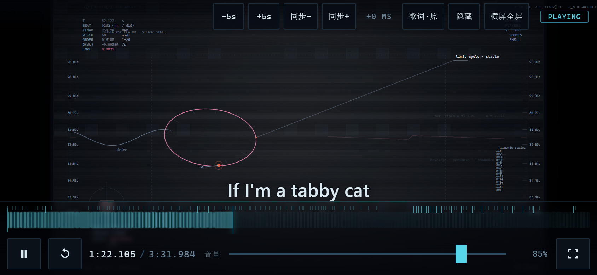
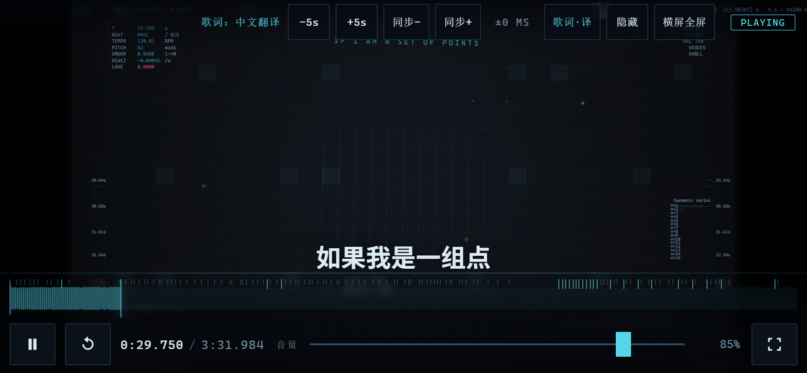
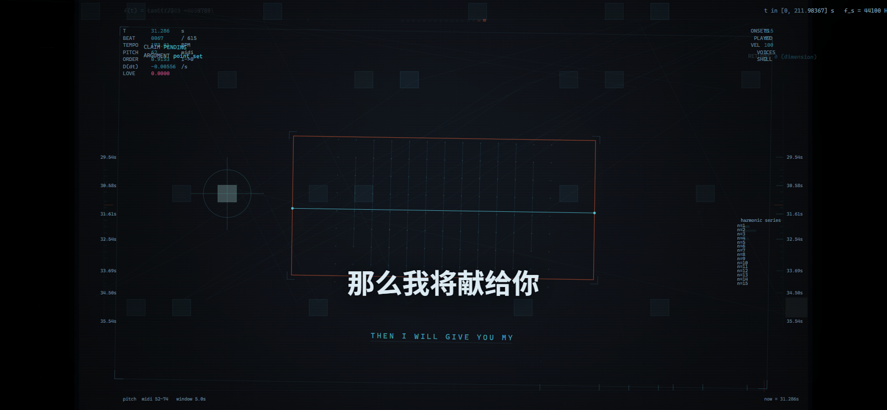
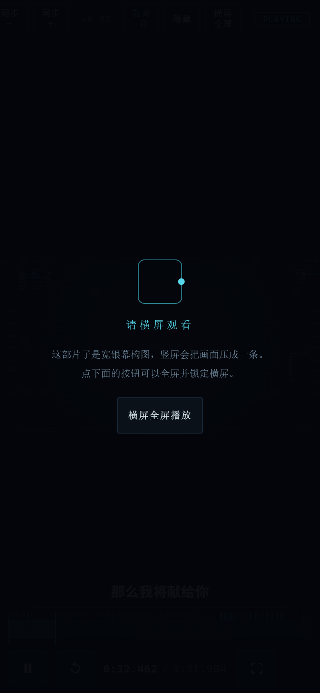

# world.execute(me); — Android 壳

把 `world.execute(me);` 这个实时网页动画 MV 装进手机里看的 Android 应用。Kotlin +
原生 WebView 为主，另外提供一个内建 HTTP 服务器，让你把影片交给手机上任意一个浏览器
内核去渲染。

**原项目一个字节都没有改动。** 这里所有文件都在 `android/` 下，`..\index.html`、
`..\src\`、`..\assets\` 全程只读。影片是按「复制过来、注入移动层」的方式打包进 APK 的。

---

## 界面

以下全部是无头 Chrome 在 **844×390、DPR 2、模拟触摸**下跑 `tools/preview-check.mjs`
拍的实机比例截图（拍的是 APK 里那一份资产，不是仓库根目录的网页）。

| 播放中（theorem 幕） | 中文字幕 |
|---|---|
|  |  |

| 隐藏界面后字幕仍在 | 竖屏兜底提示 |
|---|---|
|  |  |

顶栏从左到右：toast（临时消息，平时不占位）、`−5s`、`+5s`、`同步−`、`同步+`、
`±0 MS`、`歌词·原/译/关`、`隐藏`、`退出`（原生宿主里换成 `横屏全屏`）。

---

## 快速开始

```powershell
# 1) 把影片从仓库根目录收集进 APK 资源，并注入移动端叠加层
node tools/build-web-assets.mjs

# 2) 编译
$env:JAVA_HOME = 'C:\Program Files\Java\jdk-21.0.10'   # JDK 17 或以上
.\gradlew.bat assembleDebug

# 产物
# app\build\outputs\apk\debug\app-debug.apk
```

安装：

```powershell
& "$env:ANDROID_HOME\platform-tools\adb.exe" install -r app\build\outputs\apk\debug\app-debug.apk
```

如果原项目的 `index.html` / `src/` / `assets/` 有改动，**重跑第 1 步**即可；
`build-manifest.json` 里的哈希会让 app 在下次启动时自动重新解包，不需要手动清数据。

---

## 两种播放方式

| | 系统 WebView（默认） | 其他浏览器 |
|---|---|---|
| 内核 | 手机自带的 WebView | 你自己挑的浏览器 |
| 网络 | 完全离线 | 只走 `127.0.0.1` 回环 |
| 全屏/横屏 | app 完全控制（`sensorLandscape` + immersive） | 只能「请求」，浏览器有权拒绝 |
| 画质切换 | 支持 | 支持（作为 URL 参数传给浏览器） |

「其他浏览器」模式下，app 在 `127.0.0.1` 上起一个只服务影片文件的 HTTP 服务器，
再用 `ACTION_VIEW` 跳转到选定浏览器打开 `http://127.0.0.1:端口/index.html`。
服务器挂在**前台服务**上，这样切到浏览器之后它不会被系统低内存杀死。

### 为什么要自己写那个服务器

两个不能省的需求：

- **Range 请求。** `<audio>` 拖动进度条走的是字节范围请求。一个「你要第 1 字节？给你
  整个 8 MB」的服务器会让拖动波形完全没法用。实现覆盖 `bytes=a-b` / `bytes=a-` /
  `bytes=-n`、`206`、`416`、`If-Modified-Since` → `304`。
- **一个关着的门。** 只绑 `127.0.0.1`，且每个请求路径都与影片根目录做 canonical path
  比对，`../` 出不去。

### 分享给同一局域网的另一台手机

服务器页面上有一个**分享开关**，打开后：

- socket 从 `127.0.0.1` 改成 `0.0.0.0`，并枚举网卡取出第一个 IPv4 站点本地地址
  （枚举网卡不需要任何权限，所以 manifest 里没有一条 Wi-Fi 权限）；
- 页面上出现一个**二维码**，另一台手机扫码即可打开同一部影片（画质参数跟着 URL 一起走，
  否则对方拿到的是默认画质）。

**口令即门。** 一旦绑到 `0.0.0.0`，这台机器上的那个目录就是交给整个局域网了。所以：

- 打开分享时随机生成一段路径口令 `/s/<8位>/`，**所有请求都必须落在它下面**，否则返回 `403`
  和一页「这个地址需要扫码才能打开」。令牌**任何一位都不会回显**（连长度都不回显）。
- 口令字符集剔掉了 `0/O`、`1/l/I` 这类易混字形，因为这个串有可能被人念出来或手输。
- **每次开启都换一段新口令**，关掉即刻吊销；令牌**故意不持久化** —— 重启 app 分享地址就是新的。
  二维码是它唯一被写下来的地方。
- 每次画二维码时**重新查一次局域网地址**（而不是缓存），因为手机会在你不注意的时候换网，
  二维码里那个已经失效的旧地址是最难排查的一类故障。
- 拿不到局域网地址时**拒绝开启**：连不上的分享比干脆拒绝更糟。

二维码用 zxing 的**纯 JVM 编码器**（`com.google.zxing:core`）而不是 `zxing-android-embedded` ——
后者会带进来一个 Activity 和相机权限，而这个 app 从不扫码。二维码矩阵由
`QrCode.kt` 生成（零 Android 类型，可以被 JVM 单测解码回读），位图由 `ServeActivity` 转。
配色用影片的近白近黑而不是纯黑白：**反色码（深底浅码）在不少手机相机上读不出来**。
二维码在屏上时保持屏幕常亮，离开页面即释放。

因为分享开着时服务器对每个请求都要求口令前缀，播放器加载影片也必须走
`ServerHub.url(...)` 而不是自己拼 `http://127.0.0.1:...`。

---

## 目录结构

```
android/
├─ tools/
│  ├─ build-web-assets.mjs          影片 → APK 资源，注入叠加层，编译中文歌词表
│  ├─ preview-check.mjs             无设备验收：真浏览器 + 手机视口 + 截图
│  └─ web-overlay/                  只在手机上生效的叠加层
│     ├─ perf-head.js               <head> 里、所有引擎脚本之前
│     ├─ mobile.css                 在 src/style.css 之后加载
│     ├─ lyrics.zh.txt              中文翻译歌词（源，人手维护）
│     └─ mobile.js                  在 src/60_app.js 之后加载
└─ app/src/main/
   ├─ assets/web/                   ← 由 build-web-assets.mjs 生成（不要手改）
   │  └─ mobile/lyrics-zh.js        ← 由 lyrics.zh.txt 编译而来（不要手改）
   ├─ java/com/worldexecute/viewer/
   │  ├─ ViewerApp.kt               启动时后台预解包影片
   │  ├─ MainActivity.kt            选内核 / 画质 / 浏览器
   │  ├─ PlayerActivity.kt          WebView 播放器 + JS 桥
   │  ├─ ServeActivity.kt           浏览器模式的等待页 + 局域网分享
   │  ├─ AssetServerService.kt      前台服务，保活服务器
   │  ├─ Browsers.kt                探测已安装的浏览器
   │  ├─ AssetServer.kt             内建 HTTP/1.1 子集（含 Range、分享口令）
   │  ├─ ServerHub.kt               服务器单例持有者
   │  ├─ Share.kt                   分享口令的生成与校验（纯 JVM）
   │  ├─ QrCode.kt                  二维码矩阵（纯 JVM，无 Android 类型）
   │  ├─ LanAddress.kt              找本机局域网 IPv4 地址
   │  ├─ WebAssets.kt               从 APK 解包影片
   │  ├─ Prefs.kt                   设置
   │  └─ Diag.kt                    环形日志缓冲
   └─ res/                          主题、布局、图标、网络安全配置
```

---

## 移动端叠加层是怎么接上去的

`build-web-assets.mjs` 复制 `index.html` 之后，在**副本**上做四处注入：

1. `<script src="mobile/perf-head.js">` — 紧跟 `<meta name="viewport">` 之后
2. `<link rel="stylesheet" href="mobile/mobile.css">` — 紧跟 `src/style.css` 之后
3. `<script src="mobile/lyrics-zh.js">` — 紧跟 `src/60_app.js` 之后
4. `<script src="mobile/mobile.js">` — 紧跟 `lyrics-zh.js` 之后

第 3 处必须排在手机层之前：`mobile.js` 启动时就要读 `window.DA_LYRICS_ZH`。

四处锚点任何一处找不到，脚本直接失败退出，不会默默产出一个半成品。脚本最后会**重新读一遍
自己写出来的东西**：所有被引用的文件是否都存在、叠加层脚本是否是合法 classic script、
`lyrics-zh.js` 求值后行数与编译前是否一致、时间戳是否严格递增。最后一条尤其重要 ——
歌词表用二分查找，时间戳乱序会返回**错误的**那一行，而不是报错。

同时把 `CLIP_CANDIDATES` 数组的第一个候选改成 `'audio.mp3'`：原文件名
`Mili - world.execute (me) ;.mp3` 带着空格和分号，在 APK 资源里不值得冒险。

### 叠加层给自己的定位

三条自我约束：

- **只通过公开接口碰引擎。** 只用 `EM.__app` 上的
  `now()/seek()/play()/pause()/setOffset()/setVolume()`，加上 `EM.AUDIO_END` 和
  `EM.fmtTime()`。不读写引擎内部状态。
- **全部挂在 `html.da-mobile` / `html.da-touch` / `html.da-native` 下。** 检测不到触摸
  或引擎，就什么都不做 —— 用桌面浏览器打开这个页面时，它就是原样的影片。
- **整层包在 `try/catch` 里，永不抛。** 叠加层坏掉的后果只能是「回到原来的影片」，
  不能是「影片看不了」。

### 画质是怎么实现的

引擎在 `resize()` 里做 `DPR = Math.min(2, window.devicePixelRatio || 1)`，而这个值在
脚本解析时读一次就定了。所以叠加层在 `<head>` 里用
`Object.defineProperty(window, 'devicePixelRatio', ...)` 把它改掉，并劫持
`matchMedia('(prefers-reduced-motion: reduce)')` 让「省电」模式连动效一起减。
这是从外部能拿到的唯一一个大性能杠杆。

### 没有手机怎么验收：`preview-check.mjs`

```bat
node tools\build-web-assets.mjs
node tools\preview-check.mjs            :: 或 node tools\preview-check.mjs 8 42 82 137 199
```

这台机器上既没有模拟器也没有连接设备，而 `_tools\verify.js` 只读源码、
`_tools\render-png.js` 是配了桩 DOM 的软件光栅器 —— 两个都不会执行叠加层，
而叠加层恰好是这一层里唯一碰页面的代码。所以这个脚本把**已经打进 APK 的那一份**
影片（含注入后的 `index.html`）用一个真的 Blink 内核跑起来：

- 起一个带 Range 的本地静态服务器（`<audio>` 拖动就是 Range 请求）；
- 启动 Chrome/Edge 无头模式，通过 DevTools 协议把视口设成 844×390、打开触摸模拟、
  换成 Android UA —— 叠加层于是按手机的方式装好自己；
- 只在 `#stage` 上派发一次点击，**不额外调用任何引擎 API**：如果片子跑起来了，
  那就说明叠加层自己那条轻点→播放的链路是通的；
- 采样若干时刻，截图到 `build-preview\`，并对画布降采样算亮度 —— 全黑即判失败；
- 转成竖屏再截一张，确认「请横屏观看」那层会出来；
- 依次点三下歌词按钮，断言四个状态：原文（英文原句）→ 译文（中文）→ 关闭（`#panel`
  透明度为 0）→ 原文（英文原句**一字不差地回来了**）。

它抓到过两个真问题：右上角那个引擎**从来没有写过**的 `#clock`（永远停在
`0:00.000`，`60_app.js:37` 绑定了它但全仓库没有任何一处赋值），以及在窄屏下把它
藏掉之后残留的那个分隔斜杠。两个都只在叠加层里改了。

第三处是看它截出来的图发现的：影片把 toast 钉在距底部 176px 处（`src/style.css:435`），
那在 900px 高的桌面窗口里刚好在传输条上方，但横屏手机整个舞台只有约 390px 高，
同一个数字就落在**画面正中央**、压在图上，而且居中位置正好又是字幕行。

修法不是挪一点，而是**把 `#toast-host` 整个搬进顶栏**：顶栏左端本来就有空档（窄屏下
`.brand` 是 `display:none`、`#hud-top` 又是 `justify-content: flex-end`），正好够放一行状态，
而且就在它所报告的那个控件旁边。影片自己的 `toast()` 和叠加层的 `toast()`
写的是同一个 host，所以搬一次、两边一起搬。`preview-check.mjs` 现在会断言这条：
toast 必须落在顶栏的垂直范围内，而不是飘到画面上去。

---

## 歌词开关（关闭 / 原文 / 中文翻译）

顶栏上那个按钮在三档之间循环：**原文 → 中文翻译 → 关闭**，默认「原文」（也就是与影片
原样完全一致，真正的 no-op）。选择记在 `localStorage` 的 `da.lyrics` 里。

**为什么不新加一个元素。** 全片只有 `#lyric-line` 一个元素承载歌词 ——
`src/60_app.js:266-272` 的 `refreshLyric()` 把当前 cue 的文本写进去。画布上那些字
（`PROTECTION`、`LO-O-OVE`、`EXECUTION`）是**画面的一部分**，不是字幕：`drawSequence`
只看 `cue.scene`，从不读 `cue.text`（`src/15_sceneapi.js:255-301`）。所以复用它就自动继承了
影片自己的排版，以及引擎给说明行加的那个 `instrumental` 类（青色的等宽小字）。

**怎么分清「引擎写的英文」和「叠加层写的中文」。** `mobile.js` 记住自己最后写进去的内容；
每一帧读一次 `textContent`，只要和上次自己写的不一样，那就一定来自引擎 —— 于是那才是
需要保留的英文原句。切换到「原文」或「关闭」时把它原样写回去即可，连 held 的 `outro`
段（引擎在那一段本来就不写）也正确。用 `requestAnimationFrame` 而不是 `MutationObserver`：
rAF 在绘制之前跑，改写和引擎的写入落在同一帧内，不会闪出一帧英文。

**两表之间只认时间戳。** 中文表（`tools/web-overlay/lyrics.zh.txt`，129 行，
署名「取名好困难啊」）和影片自己的 `assets/lrc-embed.txt`（131 行）**有 126 行时间戳完全
相同**，但**绝不能按行号配对**：英文把两种语言并进一行（`Ein, dos`），中文拆成了两行，
按行号配会从这里开始**静默错位**。所以生成器按时间戳配对，并且在这些情况下直接让构建失败：

- cue 表与 `lrc-embed.txt` 对不上（条数不等，或最大偏差超过 0.5 ms）；
- 精确配对率低于 75%；
- 编译产物的行数、或时间戳的严格递增性不成立。

影片自己的说明行（`(pre-roll)`、`(instrumental — argument stack)`、`(instrumental — open loop)`、
`(outro)`）中文表没有覆盖，**这些行在中文模式下原样显示英文** —— 那是影片在说话，
替翻译者编词是越权。

### 字幕是内容，不该跟着控件一起消失

影片把 `#panel` 和顶栏、控制条写进了同一个淡出组（`src/style.css:48-50` 的
`body.hide-ui #hud-top, body.hide-ui #panel, body.hide-ui #ctrl`），叠加层原先的 5 秒自动隐藏
也照抄了这一点。结果是：点「隐藏」把画面擦干净的同时，**观众正在读的那行词也没了** ——
而词正是他们在看的东西。现在两处都不再包含 `#panel`，只有「歌词·关」能把它关掉。

`#panel` 的垂直位置**不随控件显隐变化**（始终 `bottom: 112px`）。否则自动隐藏在播放中生效时，
字幕会当着观众的面跳一下，那比位置不够完美更糟。

`preview-check.mjs` 现在会**按下真的「隐藏」按钮**再断言：`#ctrl` 与 `#hud-top` 透明度为 0，
而 `#panel` 仍为 1、且里面还有字；这一帧存成 `build-preview/chrome-hidden.png`。

### 换行时不能闪一帧英文

引擎在自己的 rAF 回调里写英文。叠加层的 rAF **可能排在它前面**执行同一帧，于是浏览器把
引擎刚写进去的英文画了出来 —— 每换一句词，观众都会先看到一帧英文，再被改成中文。
这就是那个闪帧。

所以更正**不再挂在帧上**：`lyric-line` 上挂一个 `MutationObserver`，引擎一碰这个元素，
观察者就在**微任务**里触发，早于浏览器绘制。于是两个 rAF 的先后顺序不再重要，
中文模式下英文根本到不了屏幕上。

rAF 循环保留着，做观察者做不到的那件事：中文表把其中三句拆成了两句（`一（德语）`/`二（西班牙语）`
那一组），所以中文行会在引擎没有任何理由写入的时刻变化。

`preview-check.mjs` 用「按引擎的方式写一次英文，然后只排空微任务队列」来验证这件事 ——
绘制必须等当前任务和它的微任务都跑完，所以微任务结束后若已是中文，就说明没有任何一帧被画成英文。

---

## 构建环境

| | 版本 |
|---|---|
| Gradle | 8.11.1（wrapper 已提交） |
| AGP | 8.5.2 |
| Kotlin | 2.0.0 |
| compileSdk / targetSdk | 34 |
| minSdk | 26 |
| JDK | 17+（用 21 验证过） |

`local.properties` 里的 `sdk.dir` 指向本机 Android SDK，需要按你自己的路径改。

### 资产过期会被提醒

`app/src/main/assets/web` 是**生成物**，源在 `tools/web-overlay`。两者在不同目录，
Gradle 本来无从知道「改了叠加层却没重跑生成器」——它只会安静地打包上一版。所以
`app/build.gradle.kts` 里注册了 `checkWebAssetsFreshness`，挂在 `preDebugBuild` /
`preReleaseBuild` 之前：源文件比 `build-manifest.json` 新就打印一条 `[warn]`，告诉你
去跑 `node tools/build-web-assets.mjs`。**只警告，不失败** —— 一次构建不该被一个 Node
脚本绑架。

> 写这段的注释时踩过一个坑，值得记下来：Kotlin 的块注释是**可以嵌套**的（不像 C）。
> 注释里出现 `web-overlay/` 后面跟一个 `*`，就等于开了第二层注释，而结尾那一个 `*/`
> 只把它降回第一层 —— 于是**这个文件剩下的部分被整段注释掉**，编译却照样通过，
> 表现是「脚本里后半截的语句凭空不存在」。任务因此死活注册不上。

### 签名

`app/signing/shared.jks` 是一个**共享测试签名**，密码和别名都是 `worldexecute`。
`assembleDebug` 不用它；`assembleRelease` 会用它，目的是让你能装出一个可重复、
可覆盖安装的包。要发布就得换成你自己的密钥。

### 依赖、单测与两个坑

二维码用 `com.google.zxing:core:3.5.3`。它是个纯 JVM 库，但要**先在联网状态下解析过一次**
（把 descriptor 写进 Gradle 的 `metadata-*` 缓存），之后 `--offline` 才可用 —— 本机的依赖
缓存里一开始只有 jar 和 pom，没有元数据，`--offline` 会直接报
`No cached version of com.google.zxing:core:3.5.3 available for offline mode`。

`Share.kt` / `QrCode.kt` / `AssetServer.kt` 里的逻辑都是纯 JVM 的，所以有 34 个单测
（`ShareTest` 12 / `QrCodeTest` 5 / `AssetServerTest` 17）跑在 `testDebugUnitTest` 上，
不需要设备：

```bat
gradlew :app:testDebugUnitTest --offline
```

`AssetServerTest` 会真的起一个服务器，于是会走到 `Diag.add()` → `android.util.Log`，
在 JVM 单测里这会抛 "not mocked"。所以 `build.gradle.kts` 里有
`testOptions { unitTests.isReturnDefaultValues = true }`。

> **APK 里的幽灵 4 MB。** 增量打包在这台机器上给每个条目留下过约 4.6 KB 的僵尸
> extra field（915 个条目 → 多出 4,272,981 字节），debug 包因此从 14.8 MB 涨到 19.0 MB。
> 中央目录、local file header、压缩数据三者自洽，签名块也不是原因。
> **`gradlew clean` 一跑就没了** —— 所以核验体积前先 clean。

---

## 手机适配都做了什么

- **强制横屏**：`PlayerActivity` 声明 `sensorLandscape`（横屏但允许 180° 翻转），
  启动页里那个开关关掉它才解锁。浏览器模式锁不了别人，所以叠加层在竖屏时盖一层
  「请横屏 / 点这里横屏全屏播放」。
- **immersive**：隐藏状态栏和导航栏，sticky，划一下临时出现。
- **刘海**：主题里 `windowLayoutInDisplayCutoutMode=shortEdges`；叠加层所有贴边的元素
  都吃 `env(safe-area-inset-*)`。
- **触控目标**：`.btn` 32px → 44px，`#wave` 26px → 40px（拖动时 48px），按钮最小宽度
  44px。
- **手势**：原页面 `#stage` 上的 click 只负责「第一次点击开始播放」，手机上点完就没法
  再暂停了。叠加层在捕获阶段接管 click：左侧 34% 宽 = −5 秒，右侧 34% = +5 秒，
  中间 = 播放/暂停，中间双击 = 切换。
- **自动隐藏界面**：播放中 5 秒无操作就淡出所有控件；下一次触摸只把界面叫回来，
  不会顺手暂停影片。
- **常亮**：`FLAG_KEEP_SCREEN_ON`，以及 `navigator.wakeLock`。
- **画面独占全屏**：`#shell` 从 `flex column` 改成 `block`，`#stage` 铺满整个窗口，
  原来占位的 `#ctrl` 变成底部浮层。
